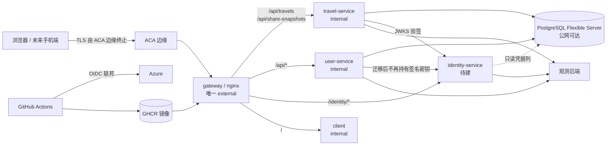

# 威胁模型

本文件是所有其他安全文档的前提：它说明信任边界在哪、有哪些资产、哪些面是敞开的，以及**哪些风险是被有意接受的**。

- 生产环境的唯一真相是 **Azure Container Apps**（`deploy-azure.sh`）。`infra/k8s/**` 已冻结为本地实验，仅在恢复维护时才需要满足其清单（见 `network-and-edge.md` 附录）。
- 定位基准：**小范围真实用户**（可注册、分享链接公网可达、数据库公网可达）——不是纯演示，也不是面向公众的大规模产品。

## 系统边界

**关键性质**：各后端服务的 `internal` 只表示「同一 ACA 环境内的容器应用可达」，**不提供对等认证**（无 mTLS、无 IP 白名单、无 NetworkPolicy），而当前环境未接 VNet 且**网络类型创建后不可改**。因此「内网」在本项目里不是一个安全边界。

## 资产

| 资产 | 所在位置（现状） | 被攻破的后果 |
|---|---|---|
| 用户凭据（PBKDF2 哈希） | `appdb` 的 `Users.PasswordHash` | 离线爆破 → 账号接管；口令复用外溢到其他站点 |
| 旅行数据（记录 / 富文本 / 图片） | `appdb` + `TravelMedia:RootPath` 本地磁盘 | 隐私泄露：精确到时间与坐标的行踪 |
| 身份令牌 | 浏览器 `localStorage`（键 `travel-map.auth.token`） | XSS 即会话接管 |
| 签名密钥 | 目前仅存在于部署侧手工配置中（`deploy-azure.sh` 未注入 `Jwt__Key`） | 可伪造任意用户令牌 |
| 数据库口令 | **已确认**：git 历史 `8faf6c5` 的值就是当前有效口令，而仓库是 **public** | 全库读写（跨用户）；任何读过该公开仓库的人都能直连（Azure 上库还是公网可达、连接串未强制 `SslMode`） |
| 服务身份凭据 | 尚未存在 | 冒用服务调用内部端点 |
| 分享快照令牌 | `appdb` | 越权读取他人足迹快照 |
| 遥测数据 | OTel Collector / Jaeger / Loki / Grafana | SQL 文本与请求元数据泄露 |
| 容器镜像 | GHCR（CI 显式设为 public） | 供应链与内部实现泄露 |
| AMap key + securityJsCode | 客户端 bundle（ADR-0003 的既定取舍） | 配额盗用 |

## 信任边界

| # | 边界 | 现状 |
|---|---|---|
| 1 | 公网 ↔ ACA 边缘 | TLS 终止；ACA HTTP ingress 默认把 80 重定向到 443（官方文档），但网关自身在明文响应上也发 HSTS |
| 2 | 边缘 ↔ gateway | 网关不做鉴权，只转发与打安全头 |
| 3 | gateway ↔ 各服务 | 同一环境内网；**当前无对等认证**，且不存在"只有网关能到我"的保证 |
| 4 | 服务 ↔ PostgreSQL | Azure 上 `--public-access Enabled`，连接串未指定 `SslMode`；本机 `pg_hba.conf` 对 local/127.0.0.1 是 `trust` |
| 5 | 服务 ↔ 观测后端 | dev 全部无认证且绑定 `0.0.0.0` |
| 6 | CI ↔ GHCR / Azure | 用 OIDC 联邦凭据登录 Azure；镜像推送后由 CI 主动改为 public |

## 攻击面（按现状证据）

| 面 | 现状证据 | 风险含义 |
|---|---|---|
| 无限流 | 全仓无 `limit_req`；登录仅 4 位数字验证码，且验证码端点可无限请求 | 口令爆破与验证码刷取零成本 |
| 无认证审计 | `AuthEndpoints.cs` 内无任何 `ILogger` 调用；无 `JwtBearerEvents` 钩子 | 认证事件不可追溯 |
| 观测栈裸露 | `docker-compose.dev.yml` 中 `loki` 的 `auth_enabled: false`、Grafana `admin/admin`、Jaeger/Prometheus/Collector 全部发布到宿主 | 未认证者可读 trace/log、可注入伪造遥测 |
| 敏感属性未脱敏 | `infra/observability/otel-collector-config.yaml` 中删除 `http.request.header.authorization` 的 attributes 段**被注释掉**，且 `debug` exporter 的 `verbosity: detailed` 挂在 traces/metrics/logs 三条管线上 | 完整 span/log 落到容器 stdout |
| 观测端点无环境判断 | `/metrics`、`/health`、`/swagger`、`/openapi/v1.json` 均无条件映射 | 直连服务即可枚举 API 与抓取指标 |
| 数据库公网可达 | `deploy-azure.sh` 的 `--public-access Enabled`；连接串无 `SslMode` | 全网可尝试连接，链路无强制加密 |
| 服务可被直连 | 后端均为 `internal`（= 环境内可达），无 NetworkPolicy | 边缘控制可被绕过 |
| 镜像公开 | `ci.yml` 用 `gh api -X PATCH ... visibility=public` | 4 个镜像任何人可匿名拉取 |
| 令牌存 `localStorage` | `core/interceptors/auth.interceptor.ts` + `auth.service.ts` | XSS 可窃取 7 天期令牌（PKCE 之前） |
| 网关未规范化请求 | `nginx.conf.template` 不设置 `Host`，`proxy_ssl_verify off` | issuer/Host 相关校验不可控 |

## 已被接受的风险（有意不做或延期）

| 风险 | 处理方式 | 依据 |
|---|---|---|
| 同环境内可直连服务 | 由「服务自证身份」兜住，网络层收口列 P2（需重建环境为 VNet） | ADR-0019 |
| 无 WAF / DDoS 防护 | 仅网关层限流；Front Door 列 P2 | `network-and-edge.md` |
| access token 不可即时撤销 | 靠 15–30 分钟 TTL + `CredentialVersion` 比对兜底 | ADR-0021 |
| AMap `securityJsCode` 明文下发 | 维持（浏览器端密钥本质上公开），靠域名白名单 | ADR-0003 |
| 第一期内 token 仍在 `localStorage` | 显式接受，用 CSP 降低 XSS 影响；PKCE 列 P2 | `authentication.md` |
| 无多租户与角色模型 | owner-only，不引入角色 claim | ADR-0021 |

## 威胁 → 措施映射

| 威胁 | 主要措施 | 归属 |
|---|---|---|
| 凭据爆破 / 撞库 | 短 TTL + 验证码 + 失败计数与限流 + 审计 | `authentication.md` |
| 令牌伪造 | 非对称签名（RS256），资源服务只持公钥 | ADR-0021 |
| 令牌窃取（XSS） | CSP（本期）+ PKCE 与内存存储（P2） | `network-and-edge.md`、`authentication.md` |
| 越权读他人旅行数据 | 归属一律取自 token、统一 404、图片继承记录权限 | `authorization.md` |
| 分享令牌被枚举/滥用 | 不可枚举 + 可吊销 + 过期 + 只授读一份快照 | `authorization.md` |
| 服务被冒用调用 | 服务身份 token + `aud`/`scope` 默认拒绝 + `/internal/*` 隔离 | ADR-0022 |
| 密钥/口令泄露 | Key Vault + 托管身份 + 轮换流程 | ADR-0023 |
| 数据库被直连 | 收口公网访问 + 强制 `SslMode` + 口令轮换 | `network-and-edge.md` |
| 遥测泄露敏感内容 | 属性过滤 + 关闭 debug exporter + 观测栈鉴权 | `observability-and-audit.md` |
| 供应链（镜像被拉取/篡改） | 镜像转私有 + 构建来源固定 | `secrets-and-keys.md` |
